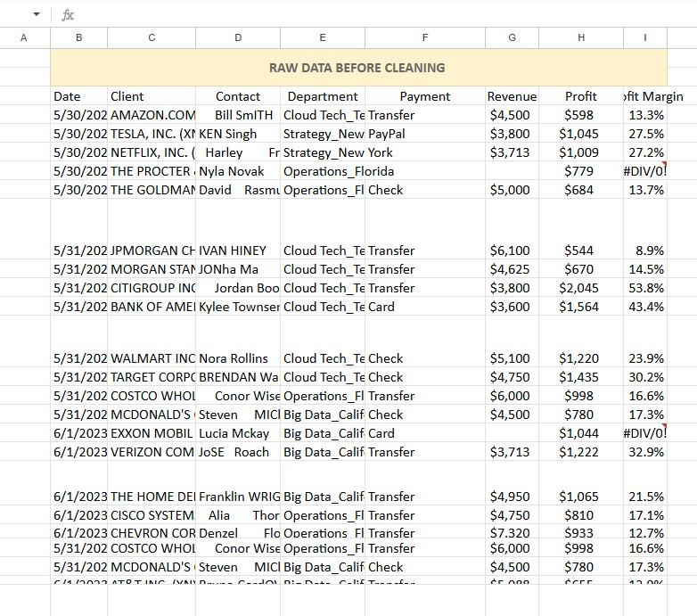

# Sales Data Cleaning Project (Google Sheets)

## Objective
Clean messy business sales data and prepare it for analysis.

## Before Cleaning
- Missing values
- Inconsistent text formatting
- Errors (#DIV/0!)
- Unstructured records

## Cleaning Steps Performed
- Missing values handled using NA
- Formatting standardized
- Data cleaned and organized
- Profit margin issues handled
- Table formatting and filters applied

## Tools Used
- Google Sheets

## Screenshots
<h3>Raw Data → Before Cleaning</h3> 

<h3>Clean Data → After Cleaning|</h3> 

